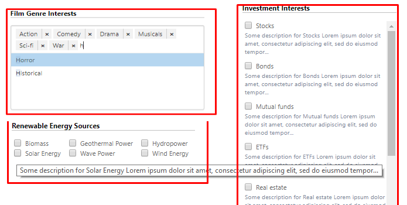

# Advanced MultiSelect for Dynamics 365 / Dynamics CRM 

'Advanced MultiSelect for Dynamics' is a control that represents a set of related data items (on a form) and gives a user an ability to associate/disassociate records of related entities in a quick and convenient way.

### You most likely are interested in this solution if

* you have Many-To-Many (N:N) relationships and would like to associate / disassociate related records in a quick, convenient and flexible way using a set of appropriate checkboxes on a form
* you are using either Dynamics CRM 2016 Update 1 (**8.1**) or Dynamics 365 (**8.2**) version and you would like to have multi select / multicheckbox functionality on a form and don't want to create a lot of dedicated checkbox attributes for each an option
* you are using the new version of Dynamics 365 (**9.0**) (_where a new multi-select functionality introduced out-of-box_) and find this out-of-box feature does not suit your needs (for example, you have to make changes in metadata each time you need to add/remove list options (instead of giving some users an ability to easily maintain the lists), you cannot support 'obsolete' options, and so forth). 

## Key Features

* Works for _any custom_ N:N relationships (including 'self-referenced' N:N relationships, e.g. account <=> account)
* Works for out-of-box 'Marketing List' N:N relationships
* Can be easily extended to work with any other out-of-box Many-to-Many relationships

* It works smoothly for both "Update" and "_Create_" record mode ('Form Type')
* The list of options can be customized flexibly using **Fetch Xml** or via an embedded wizard to build query "_like in 'Advanced Find'_" (you can select specific related records to show (e.g. that meet certain criteria you need))
* The list of options can be sorted flexibly using Fetch Xml
* You can use several existing templates to represent list of options on a form 
* You can create you own templates or modify existing ones as needed (html + css, and using knockout template styles)
* Configuration Wizard assists you in configuring all the settings and even can embed multi-select control into a form automatically (you do not need to make changes in form editor to add mult-select control on a form)

* Works in accordance with security settings on both sides of Many-To-Many relationship  
* Can works respectively with inactive/obsolete related records (e.g. shows an inactive option in case it is related / selected already, and does not show otherwise). You can select an attribute which reflects if the option is obsolete. 
* Easy configuration of options tooltip 
* Works respectively when a record is in read-only mode
* You can export / import configuration settings to transfer settings between different instances

* Works for both Online and On-Premise
* Works for Dynamics CRM 2016 Update 1 (v8.1) and Dynamics 365 (v8.2 and v9.0)

* Both Managed and Unmanaged Solutions are provided.  
* In addition to the base solution, a special DEMO solution can be installed which contains some ready-to-use examples.

### Does it use "supported" customization?
**All the _key functionality_ uses "supported" customization.** 

There is only a small part of "unsupported" customization in the "Configuration Wizard". This is embedded 'Advanced Find' builder feature which assists you in specifying query to build a list of related options. As for now, it works for all versions mentioned above. However, even in case this part stops working due to some unexpected core changes in Dynamics, it won't cause an error and you as always will be able to specify the query via Fetch Xml directly.

Note: "Configuration Wizard" also includes a wizard which makes actual modification in forms automatically. Modifying FormXml is considered as "supported" customization in Dynamics.

***

## Installation and Configuration Guide

Please read **[Installation and Configuration Guide](https://github.com/khorozhansky/Advanced-MultiSelect-for-Dynamics/wiki/Installation-and-Configuration-Guide)** in the Wiki to understand how to install base and demo solutions as well as how to start configuring settings to meet your needs.   

***

## Some Technical Details

If you would like to dig deeper into technical details find [Some Technical Details](https://github.com/khorozhansky/Advanced-MultiSelect-for-Dynamics/wiki/Some-Technical-Details) in the Wiki and/or look at the source code.

***

#### Big thanks to the following tools, add-ons and frameworks which are used inside the project or during its development:

* Jason Lattimer's [CRMDeveloperExtensions](https://github.com/jlattimer/CRMDeveloperExtensions)
* Scott Durow's [Ribbon Workbench](https://www.xrmtoolbox.com/plugins/RibbonWorkbench2016)
* Daryl LaBar's [DLaB.Xrm.XrmToolBoxTools](https://github.com/daryllabar/DLaB.Xrm.XrmToolBoxTools)
* Tanguy Touzard's [XrmToolBox](https://www.xrmtoolbox.com)
* Xrm.Page.js http://msxrmtools.com 
* KnockoutJS http://knockoutjs.com
* jQuery https://jquery.com
* Mads Kristensen's [BundlerMinifier](https://github.com/madskristensen/BundlerMinifier) 

***

This project is a brand new revised and improved version of my old https://tunemulticheckbox.codeplex.com project.
